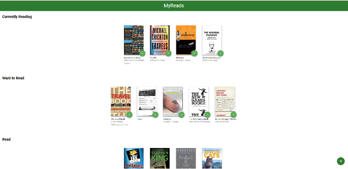
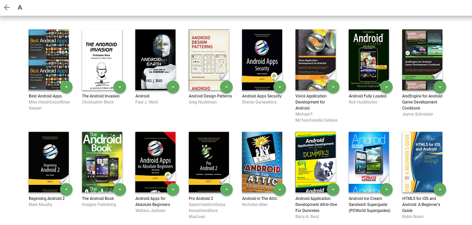

# MyReads Project

This is personal books shelf project called "MyReads"

MyReads helps to manage your books into three shelfs also you able to search the books and add them into the shelfs.

## How to start the project right away?

1. Click 'clone or download' button
2. Click 'Download ZIP'
3. Open project locally and...
* install all project dependencies with `npm install`
* start the development server with `npm start`

## Preview MyRead 

* Main page with 3 shelfs: Currently Reading shelf, Want to Read shelf and Read shelf

* Click the green button at the corner of books, the menu will pop up. You can re-arrange your books into different shelfs

* Click the green "+" button at the right down corner, you will be able to search more books 

### Search more books in searching page

## Important
The backend API uses a fixed set of cached search results and is limited to a particular set of search terms, which can be found in [SEARCH_TERMS.md](SEARCH_TERMS.md). That list of terms are the _only_ terms that will work with the backend, so don't be surprised if your searches for Basket Weaving or Bubble Wrap don't come back with any results.

